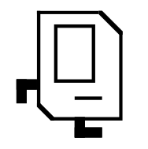
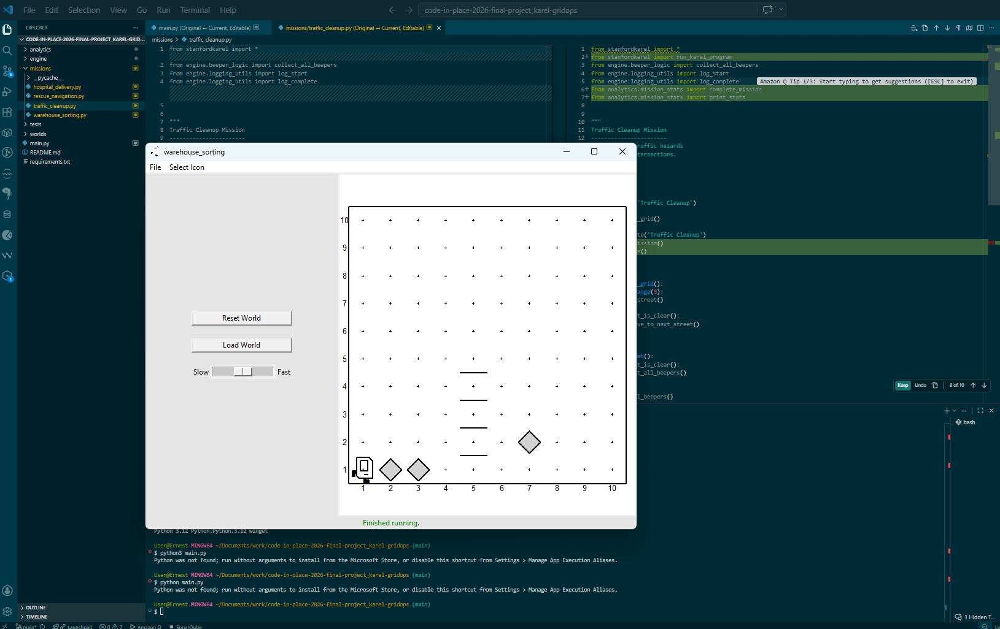

# KarelGridOps

A professional Stanford Code in Place Karel engineering project.

<!-- Cover image -->

## Features

- Strict Stanford Karel syntax
- Reusable navigation engine
- Mission-based architecture
- Warehouse simulations
- Rescue simulations
- Hospital delivery systems
- Analytics tracking
- Testable movement patterns

## Installation

<!-- Karel image -->

python -m pip install -r requirements.txt

## Run

python main.py

The app starts with a mission selector. Choose a mission number to launch the corresponding Karel world.

If `python` is not available in your shell on Windows, use the full path to your installed interpreter instead.

## Screenshots

- **First test run:**

	